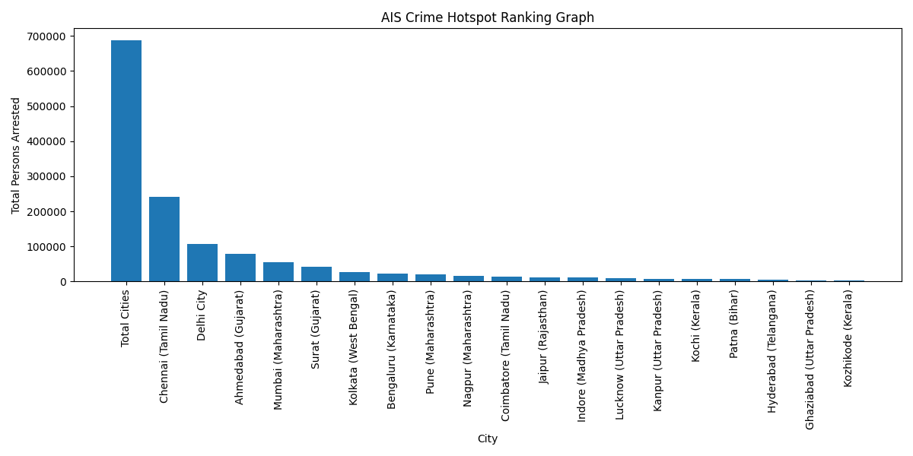

````markdown
# 🚔 Crime Risk Prediction & Hotspot Analysis System

## 🧠 Crime Risk Classification using Bio-Inspired Optimization Algorithms and Machine Learning

---

## 👤 Author

**Sagnik Patra**

---

## 📌 Project Overview

This project builds an end-to-end **Crime Risk Prediction and Hotspot Analysis System** using multiple **bio-inspired optimization algorithms**, machine learning models, and deep learning.

The system uses NCRB crime data from `NCRB_CII-2020_Table.No-19B.2.csv`, performs intelligent feature selection using optimization algorithms such as **AIS**, **CSA**, **PSO**, and **QPSO**, predicts crime risk categories, detects high-risk crime hotspots, and automatically generates reports, graphs, heatmaps, prediction CSV files, trained models, configuration files, and result summaries.

The project automatically generates:

- Crime risk prediction CSV files
- Crime hotspot ranking CSV files
- Model result CSV files
- Selected feature CSV files
- JSON result summaries
- YAML configuration files
- Accuracy graphs
- Result graphs
- Comparison graphs
- Optimization progress graphs
- Feature importance graphs
- Confusion matrix heatmaps
- Crime hotspot ranking graphs
- Trained model `.pkl` files
- Deep learning `.h5` model files
- Scaler `.pkl` files
- Encoder `.pkl` files

---



---

## 🎯 Objectives

- Analyze NCRB crime data
- Predict crime risk categories using machine learning
- Apply bio-inspired feature selection algorithms
- Reduce unnecessary input features
- Improve model efficiency and prediction accuracy
- Detect crime hotspot cities
- Classify cities into crime risk levels
- Generate accuracy reports and visual graphs
- Save trained machine learning models
- Save deep learning models
- Save scalers and encoders for future prediction use
- Generate heatmaps and confusion matrices
- Create a complete reproducible crime analytics pipeline

---

## 📂 Dataset Used

The project uses the following NCRB dataset file:

```text
NCRB_CII-2020_Table.No-19B.2.csv
````

Expected dataset path:

```text
C:\Users\NXTWAVE\Downloads\Crime Risk Prediction & Hotspot Analysis System\NCRB_CII-2020_Table.No-19B.2.csv
```

Output folder:

```text
C:\Users\NXTWAVE\Downloads\Crime Risk Prediction & Hotspot Analysis System
```

---

## 📊 Dataset Columns

The dataset contains NCRB crime-related columns representing persons arrested by age and sex across different cities.

### Important Columns

```text
City (Col. 2)
Juveniles Apprehended - Total - (Col. 5)
18 Years & Above - Below 30 Years - Total - (Col. 8)
60 Years & Above - Total - (Col. 17)
Total - Male - (Col. 18)
Total - Female - (Col. 19)
Total - Total Persons Arrested by age and Sex - (Col. 20)
```

### Target Column

```text
Total - Total Persons Arrested by age and Sex - (Col. 20)
```

This column is used to create the crime risk category.

---

## 🧪 Crime Risk Classification

The crime risk category is created using quantile-based classification.

```python
df["Crime_Risk_Category"] = pd.qcut(
    df[target_col],
    q=3,
    labels=["Low Risk", "Medium Risk", "High Risk"],
    duplicates="drop"
)
```

The generated classes are:

```text
Low Risk
Medium Risk
High Risk
```

---

## 🧬 Algorithms Used

This project uses the following bio-inspired optimization algorithms:

### 1. Artificial Immune System

**AIS** is inspired by the biological immune system.

It selects the best feature subset using cloning, mutation, and immune memory-based search.

Generated files use the prefix:

```text
ais_
```

---

### 2. Crow Search Algorithm

**CSA** is inspired by the intelligent food-hiding behaviour of crows.

It searches for the best feature subset using memory-based exploration.

Generated files use the prefix:

```text
csa_
```

---

### 3. Particle Swarm Optimization

**PSO** is inspired by the movement of birds and fish.

Particles move through the search space to identify the best feature subset.

Generated files use the prefix:

```text
pso_
```

---

### 4. Quantum-behaved Particle Swarm Optimization

**QPSO** is an improved version of PSO based on quantum behaviour.

It improves exploration and convergence while selecting useful crime-related features.

Generated files use the prefix:

```text
qpso_
```

---

## 🤖 Machine Learning Models Used

The selected features from each optimization algorithm are passed into the following models:

```text
Random Forest Classifier
Gradient Boosting Classifier
Deep Learning Neural Network
```

Random Forest is mainly used for final prediction because:

* It works well on tabular datasets
* It handles non-linear relationships
* It is robust to noisy data
* It gives stable classification performance
* It provides feature importance values

---

## ⚙️ Project Workflow

```text
Load NCRB crime dataset
        ↓
Clean missing values
        ↓
Create crime risk categories
        ↓
Perform feature engineering
        ↓
Train-test split
        ↓
Standard scaling
        ↓
Bio-inspired feature selection
        ↓
Train classification models
        ↓
Predict crime risk category
        ↓
Generate hotspot ranking
        ↓
Calculate accuracy metrics
        ↓
Generate graphs and heatmaps
        ↓
Save CSV, PNG, PKL, H5, YAML, and JSON outputs
```

---

## 📁 Project Folder Structure

```text
Crime Risk Prediction & Hotspot Analysis System/
│
├── NCRB_CII-2020_Table.No-19B.2.csv
│
├── ais_crime_risk_full_outputs.py
├── csa_crime_risk_full_outputs.py
├── pso_crime_risk_full_outputs.py
├── qpso_crime_risk_full_outputs.py
│
├── ais_result.csv
├── ais_prediction.csv
├── ais_hotspot_result.csv
├── ais_feature_importance.csv
├── ais_summary.json
├── ais_config.yaml
├── ais_model.h5
├── ais_rf_model.pkl
├── ais_gb_model.pkl
├── ais_scaler.pkl
├── ais_encoder.pkl
├── ais_selected_features.pkl
│
├── csa_result.csv
├── csa_prediction.csv
├── csa_hotspot_result.csv
├── csa_feature_importance.csv
├── csa_summary.json
├── csa_config.yaml
├── csa_model.h5
├── csa_rf_model.pkl
├── csa_gb_model.pkl
├── csa_scaler.pkl
├── csa_encoder.pkl
├── csa_selected_features.pkl
│
├── pso_result.csv
├── pso_prediction.csv
├── pso_hotspot_result.csv
├── pso_feature_importance.csv
├── pso_summary.json
├── pso_config.yaml
├── pso_model.h5
├── pso_rf_model.pkl
├── pso_gb_model.pkl
├── pso_scaler.pkl
├── pso_encoder.pkl
├── pso_selected_features.pkl
│
├── qpso_result.csv
├── qpso_prediction.csv
├── qpso_hotspot_result.csv
├── qpso_feature_importance.csv
├── qpso_summary.json
├── qpso_config.yaml
├── qpso_model.h5
├── qpso_rf_model.pkl
├── qpso_gb_model.pkl
├── qpso_scaler.pkl
├── qpso_encoder.pkl
├── qpso_selected_features.pkl
│
├── ais_accuracy_graph.png
├── ais_comparison_graph.png
├── ais_result_graph.png
├── ais_prediction_graph.png
├── ais_heatmap.png
├── ais_optimization_progress_graph.png
├── ais_hotspot_result_graph.png
├── ais_feature_importance_graph.png
│
├── csa_accuracy_graph.png
├── csa_comparison_graph.png
├── csa_result_graph.png
├── csa_prediction_graph.png
├── csa_heatmap.png
├── csa_optimization_progress_graph.png
├── csa_hotspot_result_graph.png
├── csa_feature_importance_graph.png
│
├── pso_accuracy_graph.png
├── pso_comparison_graph.png
├── pso_result_graph.png
├── pso_prediction_graph.png
├── pso_heatmap.png
├── pso_optimization_progress_graph.png
├── pso_hotspot_result_graph.png
├── pso_feature_importance_graph.png
│
├── qpso_accuracy_graph.png
├── qpso_comparison_graph.png
├── qpso_result_graph.png
├── qpso_prediction_graph.png
├── qpso_heatmap.png
├── qpso_optimization_progress_graph.png
├── qpso_hotspot_result_graph.png
└── qpso_feature_importance_graph.png
```

---

## 📌 Output Files Generated

### AIS Output Files

```text
ais_result.csv
ais_prediction.csv
ais_hotspot_result.csv
ais_feature_importance.csv
ais_summary.json
ais_config.yaml
ais_model.h5
ais_rf_model.pkl
ais_gb_model.pkl
ais_scaler.pkl
ais_encoder.pkl
ais_selected_features.pkl
ais_accuracy_graph.png
ais_comparison_graph.png
ais_result_graph.png
ais_prediction_graph.png
ais_heatmap.png
ais_optimization_progress_graph.png
ais_hotspot_result_graph.png
ais_feature_importance_graph.png
```

---

### CSA Output Files

```text
csa_result.csv
csa_prediction.csv
csa_hotspot_result.csv
csa_feature_importance.csv
csa_summary.json
csa_config.yaml
csa_model.h5
csa_rf_model.pkl
csa_gb_model.pkl
csa_scaler.pkl
csa_encoder.pkl
csa_selected_features.pkl
csa_accuracy_graph.png
csa_comparison_graph.png
csa_result_graph.png
csa_prediction_graph.png
csa_heatmap.png
csa_optimization_progress_graph.png
csa_hotspot_result_graph.png
csa_feature_importance_graph.png
```

---

### PSO Output Files

```text
pso_result.csv
pso_prediction.csv
pso_hotspot_result.csv
pso_feature_importance.csv
pso_summary.json
pso_config.yaml
pso_model.h5
pso_rf_model.pkl
pso_gb_model.pkl
pso_scaler.pkl
pso_encoder.pkl
pso_selected_features.pkl
pso_accuracy_graph.png
pso_comparison_graph.png
pso_result_graph.png
pso_prediction_graph.png
pso_heatmap.png
pso_optimization_progress_graph.png
pso_hotspot_result_graph.png
pso_feature_importance_graph.png
```

---

### QPSO Output Files

```text
qpso_result.csv
qpso_prediction.csv
qpso_hotspot_result.csv
qpso_feature_importance.csv
qpso_summary.json
qpso_config.yaml
qpso_model.h5
qpso_rf_model.pkl
qpso_gb_model.pkl
qpso_scaler.pkl
qpso_encoder.pkl
qpso_selected_features.pkl
qpso_accuracy_graph.png
qpso_comparison_graph.png
qpso_result_graph.png
qpso_prediction_graph.png
qpso_heatmap.png
qpso_optimization_progress_graph.png
qpso_hotspot_result_graph.png
qpso_feature_importance_graph.png
```

---

## 📈 Evaluation Metrics

The classification models are evaluated using the following metrics:

### Accuracy

Measures the percentage of correctly predicted crime risk categories.

```text
Higher accuracy means better classification performance.
```

---

### Precision

Measures how many predicted positive classifications are correct.

```text
Higher precision means fewer false positives.
```

---

### Recall

Measures how many actual positive classes were correctly identified.

```text
Higher recall means fewer false negatives.
```

---

### F1-Score

Balances precision and recall.

```text
Higher F1-score means better overall classification quality.
```

---

### Confusion Matrix

Shows actual vs predicted crime risk categories.

```text
Useful for identifying misclassification between Low, Medium, and High Risk classes.
```

---

## 📊 Graphs Generated

### 1. Accuracy Graph

Shows model accuracy comparison.

Example:

```text
ais_accuracy_graph.png
```

---

### 2. Comparison Graph

Shows performance comparison among models.

Example:

```text
ais_comparison_graph.png
```

---

### 3. Result Graph

Shows final model result visually.

Example:

```text
ais_result_graph.png
```

---

### 4. Prediction Graph

Shows count of predicted crime risk categories.

Example:

```text
ais_prediction_graph.png
```

---

### 5. Optimization Progress Graph

Shows fitness improvement across iterations or generations.

Example:

```text
ais_optimization_progress_graph.png
```

---

### 6. Confusion Matrix Heatmap

Shows classification performance in heatmap form.

Example:

```text
ais_heatmap.png
```

---

### 7. Hotspot Result Graph

Shows crime hotspot ranking by total persons arrested.

Example:

```text
ais_hotspot_result_graph.png
```

---

### 8. Feature Importance Graph

Shows the most important selected crime-related features.

Example:

```text
ais_feature_importance_graph.png
```

---

## 🧾 Prediction CSV Format

Each prediction CSV contains:

```text
Original dataset columns
Predicted_Risk_Label
Risk_Score
```

Example file:

```text
ais_prediction.csv
```

---

## 🧾 Hotspot CSV Format

Each hotspot CSV contains:

```text
City
Total Persons Arrested
Predicted Risk Label
```

Example file:

```text
ais_hotspot_result.csv
```

---

## 🧬 Feature Importance CSV Format

Each feature importance CSV contains:

```text
Feature
Importance
```

Example file:

```text
ais_feature_importance.csv
```

---

## 🧠 Model Saving

Each algorithm saves trained models as `.pkl` and `.h5` files.

Example:

```text
ais_rf_model.pkl
ais_gb_model.pkl
ais_model.h5
```

These files can be reused later for prediction without retraining.

---

## ⚖️ Scaler and Encoder Saving

Each algorithm saves the fitted scaler and label encoder.

Example:

```text
ais_scaler.pkl
ais_encoder.pkl
```

The scaler is used to standardize input features.

The encoder is used to convert crime risk labels into machine-readable values and back into readable labels.

---

## 🛠️ Technologies Used

```text
Python
NumPy
Pandas
Matplotlib
Scikit-learn
TensorFlow
Keras
Random Forest Classifier
Gradient Boosting Classifier
Deep Learning
Bio-Inspired Optimization
Crime Analytics
Machine Learning
```

---

## 📦 Required Libraries

Install the required Python libraries using:

```bash
pip install pandas numpy matplotlib scikit-learn tensorflow pyyaml
```

---

## ▶️ How to Run the Project

### Step 1: Keep Dataset in Correct Folder

Place the dataset at:

```text
C:\Users\NXTWAVE\Downloads\Crime Risk Prediction & Hotspot Analysis System\NCRB_CII-2020_Table.No-19B.2.csv
```

---

### Step 2: Open Command Prompt

Go to the project folder:

```bash
cd "C:\Users\NXTWAVE\Downloads\Crime Risk Prediction & Hotspot Analysis System"
```

---

### Step 3: Run AIS Code

```bash
python ais_crime_risk_full_outputs.py
```

---

### Step 4: Run CSA Code

```bash
python csa_crime_risk_full_outputs.py
```

---

### Step 5: Run PSO Code

```bash
python pso_crime_risk_full_outputs.py
```

---

### Step 6: Run QPSO Code

```bash
python qpso_crime_risk_full_outputs.py
```

---

## 🧪 Sample Console Output

```text
Generation 1/20 | Best Fitness: 0.7321
Generation 2/20 | Best Fitness: 0.7544
Generation 3/20 | Best Fitness: 0.7812
...
All AIS results saved successfully in:
C:\Users\NXTWAVE\Downloads\Crime Risk Prediction & Hotspot Analysis System

Generated AIS Files:
ais_model.h5
ais_rf_model.pkl
ais_gb_model.pkl
ais_scaler.pkl
ais_encoder.pkl
ais_selected_features.pkl
ais_config.yaml
ais_summary.json
ais_result.csv
ais_prediction.csv
ais_hotspot_result.csv
ais_feature_importance.csv
ais_optimization_progress_graph.png
ais_accuracy_graph.png
ais_comparison_graph.png
ais_heatmap.png
ais_result_graph.png
ais_prediction_graph.png
ais_hotspot_result_graph.png
ais_feature_importance_graph.png
```

---

## 📌 Result Summary JSON

Each algorithm saves a JSON summary file.

Example:

```text
ais_summary.json
```

It contains:

```json
{
    "rows": 19,
    "columns": 24,
    "algorithm": "Artificial Immune System",
    "best_ais_fitness": 0.8235,
    "selected_features": [
        "Juveniles Apprehended - Total - (Col. 5)",
        "18 Years & Above - Below 30 Years - Total - (Col. 8)",
        "Male_Female_Ratio",
        "Youth_18_30_Percentage"
    ],
    "selected_feature_count": 4,
    "ais_random_forest_accuracy": 0.8,
    "ais_gradient_boosting_accuracy": 0.8,
    "ais_deep_learning_accuracy": 0.6,
    "classes": [
        "High Risk",
        "Low Risk",
        "Medium Risk"
    ]
}
```

---

## 📊 Comparative Algorithm Study

This project can be used to compare the performance of:

```text
AIS vs CSA vs PSO vs QPSO
```

Comparison can be done using:

* Accuracy
* Precision
* Recall
* F1-score
* Number of selected features
* Optimization fitness progress
* Confusion matrix performance
* Feature importance values
* Crime hotspot ranking
* Prediction distribution

---

## 🏆 Expected Outcome

The system produces:

* Optimized crime-related feature subsets
* Accurate crime risk category predictions
* City-wise crime hotspot ranking
* Performance evaluation metrics
* Machine learning models
* Deep learning models
* Graphical visualizations
* Research-ready outputs
* A complete comparative study of optimization algorithms

---

## 🔮 Future Enhancements

* Add more machine learning models such as XGBoost, LightGBM, SVM, and CatBoost
* Add advanced deep learning models
* Build a web dashboard using Streamlit or Flask
* Add GIS-based crime hotspot mapping
* Add state-wise and district-wise crime forecasting
* Include year-wise NCRB datasets for time-series forecasting
* Add real-time crime analytics dashboard
* Compare more optimization algorithms
* Add ensemble prediction using multiple optimized models

---

## 📚 Research Applications

This project is useful for:

* Crime analytics
* Public safety analysis
* Smart city crime monitoring
* Crime hotspot detection
* Law enforcement decision support
* Machine learning research
* Bio-inspired optimization research
* Academic final-year and M.Tech projects

---

## ✅ Conclusion

This project presents a complete **Crime Risk Prediction and Hotspot Analysis System** using machine learning and bio-inspired optimization algorithms.

By combining **AIS**, **CSA**, **PSO**, and **QPSO** with machine learning classifiers and deep learning, the system selects important crime-related features, predicts crime risk categories, detects hotspots, and generates complete reports and visualizations.

The project is suitable for academic research, public safety analytics, and machine learning-based crime intelligence systems.

---

## 👤 Author

**Sagnik Patra**

---

```
```
